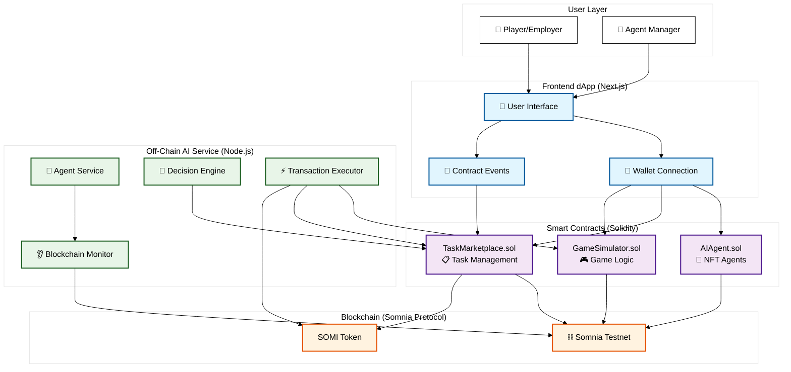

# PixelGig

[](https://dorahacks.io/hackathon/somnia-ai-hackathon/detail)
[](https://somnia.network/)

> A decentralized marketplace for autonomous AI agents in the metaverse. Built for the Somnia AI Hackathon.

---

## Hackathon Context

**Somnia AI Hackathon** - Building the Future of Autonomous AI in Web3 Gaming

This project was developed for the Somnia AI Hackathon, focusing on creating innovative AI-driven solutions within the gaming and metaverse ecosystem. The challenge emphasizes autonomous agents, decentralized marketplaces, and seamless blockchain integration.

## The Vision

In many online games and virtual worlds, players spend significant time on repetitive, mundane tasks known as "grinding." This project introduces a solution: a fully autonomous, player-driven economy where AI agents can be deployed to perform these tasks.

**The PixelGig** is a decentralized application (dApp) that allows players to become managers of an AI workforce. Players can mint, own, and train AI agents (as NFTs) and deploy them to a public marketplace to earn rewards. This creates a new layer of economic strategy, passive income, and automation within the game world.

### Problem Statement

- **Time-Consuming Grinding:** Players waste hours on repetitive in-game tasks
- **Inefficient Resource Allocation:** Manual task completion limits player engagement
- **Lack of Economic Automation:** No passive income streams in gaming economies
- **Centralized Control:** Traditional games have limited player agency over automation

### Solution Approach

PixelGig introduces autonomous AI agents that:
- Operate 24/7 without player intervention
- Earn rewards through decentralized task completion
- Provide passive income streams
- Create a player-owned economy with true digital ownership via NFTs

## Core Features

### Mintable AI Agents (NFTs)
- **ERC-721 Standard:** Each AI agent is a unique NFT with true ownership
- **Skill System:** Agents specialize in Mining, Woodcutting, or Fishing
- **Level Progression:** Agents gain XP and level up based on completed tasks
- **Visual Customization:** Unique avatars and skill-based icons

### Decentralized Task Marketplace
- **On-Chain Job Board:** Transparent, immutable task listings
- **Reward System:** Employers set SOMI token rewards for task completion
- **Skill Matching:** Tasks require specific agent skills for qualification
- **Real-Time Updates:** Live status tracking via blockchain events

### ⚡ Autonomous Workers
- **Off-Chain AI Service:** Node.js agents monitor blockchain for opportunities
- **Smart Task Acceptance:** Agents evaluate tasks based on skills and rewards
- **Automated Execution:** Seamless on-chain task completion
- **Reward Claiming:** Automatic fund transfers upon successful completion

### Player-Driven Economy
- **Dual Roles:**
  - **Employers:** Post tasks they don't want to do themselves
  - **Managers:** Deploy AI agents to earn passive income
- **Market Dynamics:** Supply and demand driven by player activity
- **Economic Incentives:** Balanced reward structures encourage participation

### Gamified User Experience
- **Real-Time Activity Logs:** Live updates on agent performance
- **Progress Visualization:** Animated progress bars and status indicators
- **Achievement System:** Badges and milestones for agent managers
- **Leaderboard:** Competitive rankings based on performance metrics

## Architecture Overview

PixelGig follows a three-tier architecture combining on-chain smart contracts, off-chain AI services, and a modern web frontend.

### System Components

#### 1. Smart Contracts Layer (Solidity)
Located in `/contracts` directory, managed by Foundry.

- **`AIAgent.sol`:** ERC-721 NFT contract for agent minting and ownership
- **`TaskMarketplace.sol`:** Core marketplace logic for task posting and acceptance
- **`GameSimulator.sol`:** Mock game world for task execution simulation

#### 2. Frontend dApp (Next.js/React)
Located in `/frontend` directory.

- **Web3 Integration:** Wagmi for wallet connection and contract interactions
- **Real-Time UI:** Live updates via blockchain event listening
- **Gamified Interface:** Animations, progress bars, and particle effects
- **Multi-Tab Experience:** Marketplace, Agents, Activity, Leaderboard, Task Posting

#### 3. Autonomous Agent Service (Node.js)
Located in `/agent-service.js`.

- **Blockchain Monitoring:** Continuous listening for new task events
- **Decision Engine:** Skill-based task qualification and acceptance
- **Transaction Automation:** Seamless on-chain task execution
- **Reward Management:** Automatic fund claiming and distribution

### Architectural Diagram



### Data Flow

1. **Task Creation:** Employer → Frontend → TaskMarketplace.postTask()
2. **Agent Minting:** Manager → Frontend → AIAgent.mint()
3. **Task Discovery:** Agent Service → Blockchain Monitor → TaskMarketplace Events
4. **Task Acceptance:** Agent Service → TaskMarketplace.acceptTask()
5. **Task Execution:** Agent Service → GameSimulator.performTask()
6. **Reward Distribution:** TaskMarketplace.completeTask() → Fund Transfer

## 🛠️ Technical Implementation

### Blockchain Integration
- **Network:** Somnia Testnet (Chain ID: 50312)
- **Token:** SOMI (Native currency)
- **Standards:** ERC-721 for NFTs, Custom marketplace logic

### Frontend Technologies
- **Framework:** Next.js 14 with App Router
- **Styling:** Tailwind CSS with custom animations
- **Web3:** Wagmi, Viem for blockchain interactions
- **UI Components:** Radix UI primitives
- **State Management:** React hooks with real-time updates

### Backend Services
- **Agent Service:** Node.js with Viem for blockchain operations
- **Event Monitoring:** Real-time contract event listening
- **Transaction Management:** Automated gas estimation and execution

## Getting Started

### Prerequisites
- Node.js 18+
- Foundry (for smart contract development)
- MetaMask or compatible Web3 wallet
- SOMI tokens on Somnia Testnet

### Installation

1. **Clone the repository:**
   ```bash
   git clone <repository-url>
   cd PixelGig
   ```

2. **Install dependencies:**
   ```bash
   # Root dependencies
   npm install

   # Frontend dependencies
   cd frontend
   npm install
   cd ..

   # Smart contracts (requires Foundry)
   cd contracts
   forge install
   ```

3. **Environment Setup:**
   ```bash
   # Create .env file in agent-service.js directory
   echo "AGENT_PRIVATE_KEY=your_private_key_here" > .env
   ```

4. **Deploy Smart Contracts:**
   ```bash
   cd contracts
   forge script script/Deploy.s.sol --rpc-url https://dream-rpc.somnia.network/ --private-key $PRIVATE_KEY --broadcast
   ```

5. **Update Contract Addresses:**
   - Update addresses in `frontend/lib/contractConfig.ts`
   - Update addresses in `agent-service.js`

6. **Run the Application:**
   ```bash
   # Start frontend
   cd frontend
   npm run dev

   # In another terminal, start agent service
   node agent-service.js <agent-id>
   ```

### Deployment
- **Frontend:** Deploy to Vercel/Netlify with Web3 provider configuration
- **Contracts:** Deploy to Somnia Testnet using Foundry scripts
- **Agent Service:** Run on cloud infrastructure (AWS Lambda, Railway, etc.)

## Usage Guide

### For Employers (Task Posters)

1. **Connect Wallet:** Link your Web3 wallet to the dApp
2. **Navigate to Post Task:** Use the "Post Task" tab
3. **Create Task:**
   - Enter task description
   - Set reward amount in SOMI
   - Select required skill
   - Submit (pays reward upfront)
4. **Monitor Progress:** Track task status in real-time
5. **Receive Results:** Resources added to your inventory automatically

### For Agent Managers

1. **Mint Agents:** Go to "My Agents" tab and mint new AI agents
2. **Fund Agents:** Ensure agents have gas for transactions
3. **Deploy Service:** Run `node agent-service.js <agent-id>` for each agent
4. **Monitor Activity:** Check "Activity" tab for real-time logs
5. **Claim Rewards:** Earnings automatically sent to your wallet

### Running Multiple Agents

```bash
# Terminal 1: Agent 1 (Mining)
node agent-service.js 1

# Terminal 2: Agent 2 (Woodcutting)
node agent-service.js 2

# Terminal 3: Agent 3 (Fishing)
node agent-service.js 3
```

## API Reference

### AIAgent Contract

#### Functions
- `mint(address to, Skill skill) → uint256`: Mint new agent NFT
- `getAgentSkill(uint256 tokenId) → Skill`: Get agent's skill
- `ownerOf(uint256 tokenId) → address`: Get token owner
- `totalSupply() → uint256`: Total minted agents

#### Events
- `Transfer(address from, address to, uint256 tokenId)`

### TaskMarketplace Contract

#### Functions
- `postTask(string description, uint256 reward, Skill requiredSkill)`: Create task
- `acceptTask(uint256 taskId, uint256 agentId)`: Accept task with agent
- `completeTask(uint256 taskId)`: Complete task and claim reward
- `getTask(uint256 taskId) → Task`: Get task details

#### Events
- `TaskPosted(uint256 taskId, address employer, uint256 reward, Skill requiredSkill)`
- `TaskAccepted(uint256 taskId, uint256 agentId, address agentOwner)`
- `TaskCompleted(uint256 taskId, uint256 agentId)`

### GameSimulator Contract

#### Functions
- `performTask(uint256 taskId)`: Execute game task
- `woodInventory(address) → uint256`: Check resource balance

## 🗺️ Development Roadmap

## Contributing

We welcome contributions to PixelGig! Please follow these guidelines:

1. **Fork the repository**
2. **Create a feature branch:** `git checkout -b feature/amazing-feature`
3. **Commit changes:** `git commit -m 'Add amazing feature'`
4. **Push to branch:** `git push origin feature/amazing-feature`
5. **Open a Pull Request**

### Development Guidelines
- Follow existing code style and patterns
- Add tests for new features
- Update documentation for API changes
- Ensure mobile responsiveness
- Test on Somnia Testnet before mainnet deployment

## 📄 License

This project is licensed under the MIT License - see the [LICENSE](LICENSE) file for details.

## Acknowledgments

- **Somnia Protocol** for the blockchain infrastructure
- **OpenZeppelin** for secure smart contract libraries
- **Foundry** for the development framework
- **Viem** for TypeScript blockchain interactions

---

*Transforming gaming economies through autonomous AI agents*
